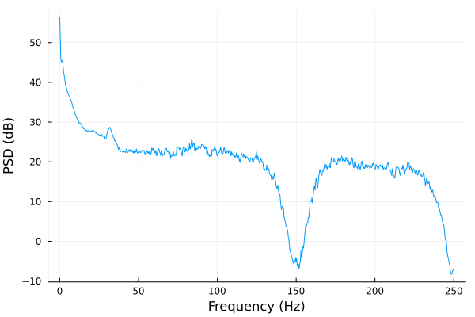

# EEG Toolkit

> :last_quarter_moon_with_face: Developed at the [Laboratory for the Study of
> Sleep Slow-wave activity](https://www.med.upenn.edu/slowwavelab/)

A scientific package for computational EEG analysis with an
emphasis on methodological transparency. Current features:

- EEG Computational Toolkit
    - Loading EEG data
    - EEG visualization
    - Sleep stage handling and NREM period detection
    - Power spectral analysis
    - Spindle detection algorithms


### Reading EEG data

Reading EEG data is straightforward. The `EEG` function
`EEG(file, fs,
epoch_length, staging)` reads an EDF file and instantiates an `EEG` structure.
`epoch_length` is the length in seconds that is understood to account for an
epoch. `staging` is an optionary vector of strings (e.g. `[W, W, W, … , REM,
REM, N1, N2, N2, … ]`) s.t. `staging[i] = σ` implies that the `i`th epoch
corresponds to the `σ` sleep stage. This is of course specific to sleep
neuroscience.

For example, I have a test EDF file with a full-night EEG called `edf2.edf`.

```julia 
eeg = EEG("edf2.edf", 500, 30, [])
```

The `signals` dictionary field in an `EEG` is a `String ->
Vector{<:AbstractFloat}` association containing all EEG channels. In this case, 

```julia 
print(keys(eeg.signals))

> ["Leg 1", "EEG C4-A1", "Leg 2", "EMG Chin", "EEG F3-A2", "EEG C3-A2", "EOG ROC-A2", "EEG F4-A1", "ECG II", "EEG O1-A2", "SpO2", "ECG I", "EEG O2-A1", "EOG LOC-A2"]
```

### Epoching 

Let $N$ denote the length of the EEG signals in samples (not in time). It is
easy to see that $N = E E_n f_s$ where $E$ is the epoch length and $E_n$ the
number of epochs in the EEG.

Informally, an epoch is a time region. This package implements the following
semantics: an `epoch` is a function $e : \mathbb{N} \mapsto \mathbb{N}^2$ s.t.
$e(n) = (i, j)$ is interpreted as: the indexes $i, i+1, \ldots, j$ of a signal
$s_1, \ldots, s_N$ correspond to the $n$th epoch. Via multiple dispatch, we 
extend this semantics in Julia by overloading the notation $e$ with the
following definition: $e : \mathbb{N}^2 \to \mathbb{N}^2$ is s.t. $e(n, m) = (i,
j)$ is interpreted as: the indexes $i, i+1, \ldots, j$ of a signal $s_1, \ldots, s_N$ 
correspond to all values in the epochs $n, n+1, \ldots, m$.

The corresponding `epoch(eeg, n, channel)` and `epoch(eeg, n, m, channel)`
functions can be used to rapidly extract subsets of the EEG. For example,

```julia
signal = epoch(eeg, 100, 200, "EEG C3-A2") # Extract all data from C3-A2 from epoch 100 to epoch 200.
```

### Spectral analysis

It is straightforward to compute the spectrogram of a signal.


```julia
S = Spectrogram(signal, eeg.fs, 3, 0.5) # Compute spectrogram with 3 second segments and 0.5 segment overlap.
p = plot_spectrogram(S, 30.0, 2) # Plot the spectrogram with limit frequency 30.0; type 2 plot = surface plot.
```


We can also take a look at the spectrogram as a heatmap:

```julia
p = plot_spectrogram(S, 30.0, 1, :inferno) # Color scheme inferno is better for heatmaps
```

 

The power spectrum is easily computed and easily plotted. It is easy to set Welch's method, Barlett's method, 
or direct (no segmentation) PSD estimation. In this case we use Welch's method with 3 second windows and $0.5$ overlap.

```julia
psd = PSD(signal, eeg.fs, eeg.fs * 3,0.5)
plot(psd.freq, pow2db.(psd.spectrum), xlab="Frequency (Hz)", ylab="PSD (dB)", legend=false)
```

The `psd` function has an optional last argument (left unwritten in our example) called 
`normalization`. It represents any additional normalization factor to be used in normalizing 
the PSD.

For transparency, the `PSD` struct contains the fields `method` and `formula`, which 
hold methodological information about how the PSD was computed. This is intended to avoid 
obscurities typical of other packages (for example, what normalization factors 
are being used). In this case,

```
julia> psd.method
"Welch's method"

julia> psd.formula
"1/(M * normalization) ∑ ᵢᴹ [ 2|Hᵢ(f)|² / ∑  wᵢ² ]  where w₁, …, wₗ a Hanning window, M the number of segments, and Hᵢ(f) the FFT of the ith segment of the signal. "
```


 

### Signal filtering 

Our filtering functions are simply wrappers around the `DSP.jl` package 
and are very easy to use. The dispatches of the `filter!` function are:

```julia
filter!(eeg::EEG, channel::String, digfilter, cut_off)

filter!(eeg::EEG, channels::Vector{<:String}, digfilter, cut_off)

filter!(eeg::EEG, digfilter, cut_off)
```

If no channel is given, all EEG signals are filtered. For example,
`filter!(eeg, Lowpass, 1)` applies a low-pass filter with cut-off frequency
$1$Hz to all EEG signals.

### Spindle detection 

This package implements two spindle detection algorithms discussed in [O'Reilly
and Nielsen (2015)](https://doi.org/10.3389/fnhum.2015.00353). We give a brief
overview of them here but refer to their original publications for further
detail.

**Sigma Index Algorithm** : The Sigma Index algorithm [(Huupponen et al.,
2007)](https://pubmed.ncbi.nlm.nih.gov/17555950/) uses the amplitude spectrum to
find spindles by characterizing abnormal values among the spindle frequency
band. Per each $1$ second window of the EEG, $a.$ the
maximum amplitude in the spindle frequency, which we call $S_{max}$, $b.$ the
average amplitude in the low alpha and theta frequencies, which we call
$\alpha_{mean}, \theta_{mean}$, and $c.$ the maximum alpha amplitude
$\alpha_{max}$, are computed. The sigma index is defind to be 

$$f(S_{max}, \alpha_{mean}, \beta_{mean}) = \begin{cases} 
0 & \alpha_{max} > S_{max} \\ 
\frac{2S_{max}}{\alpha_{mean} + \beta_{mean} } & otherwise
\end{cases}$$

Higher values are indicative of a higher spindle probability. The rejection
threshold recommended in the original paper is $\lambda = 4.5$.

The corresponding Julia function is ```sigma_index(x::Vector{<:AbstractFloat}, fs::Integer)```.


**Relative Spindle Power Algorithm** : The Relative Spindle Power (RSP)
algorithm [(Devuyst et al., 2011)](https://pubmed.ncbi.nlm.nih.gov/22254656/)
also uses the amplitude spectrum to find spindles by characterizing abnormal values
among the spindle frequency band. Its approach is more direct and parsimonious,
however. For every $1$ second window, the amplitude spectrum $S(t)$ is computed, and
the RSP is defined as

$$RSP(t) = \frac{\int_{11}^{16} S(t, f) df}{\int_{0.5}^{40} S(t, f) df}$$

This definition is more intelligible than the that of the sigma index, insofar
as it represents the ratio of the total power in the spindle band with respect
to the total power in the delta-theta-alpha-beta frequency range. It is evident
that $0 \leq RSP \leq 1$. Higher values are indicative of a higher spindle
probability---though it should be clear that $RSP$ is not a probability itself.
The rejection threshold recommended in the original paper is $\lambda = 0.22$.

The corresponding Julia function is ```relative_spindle_power(x::Vector{<:AbstractFloat}, fs::Integer)```.

### NREM Period Detection

Following [Feinberg & Floyed](https://pubmed.ncbi.nlm.nih.gov/220659/) and
Dijk, a NREM period is a succession of epochs satisfying the following two conditions:

- It starts with at least 15 minutes of stages 2, 3 or 4.
- It ends with either $a.$ at least 5 minutes of REM or $b.$ wakefulness. 

Given a succession of stages $s_1, \ldots, s_n$, with $s_i$ the sleep stage of
the $i$th epoch, an algorithm that finds the pattern above by iterating over a
vector is cumbersome. But one may define the alphabet $\Sigma = \{1, 2, 3, 4,
5, 6\}$, where $1, \ldots, 4$ denote the homonimous sleep stages, $5$
denotes REM and $6$ denotes wakefulness. Then the succession $s_1, \ldots, s_n$
may be treated as a word $\alpha \in \Sigma^{*}$ of the form 

$$
\alpha = \psi_1 \beta_1 \psi_2 \beta_2 \ldots \psi_k\beta_k \psi_{k+1}
$$

where $\psi_i$ is an arbitrary word and

$$
\beta_i = \varphi (5^M5^* | 6)
$$

with $\varphi \in \{ w \in \{2, 3, 4\}^+ : |w| \geq N \}$, $N$ the minimum
duration imposed for NREM periods, $M$ the minimum duration imposed for ending
REM periods. Thus, the problem of finding the $k$ underlying NREM periods 
in a series of sleep stages becomes the problem of finding the $k$ substrings
$\beta_1, \ldots, \beta_k$ of $\alpha$. This problem is trivial from an 
implementation perspective, since programming languages include regular expressions 
natively.


Subtleties, such as not imposing a minimum duration to the ending REM period 
of the first NREM period, can easily be adapted into the regular expression of each $\beta_i$.


